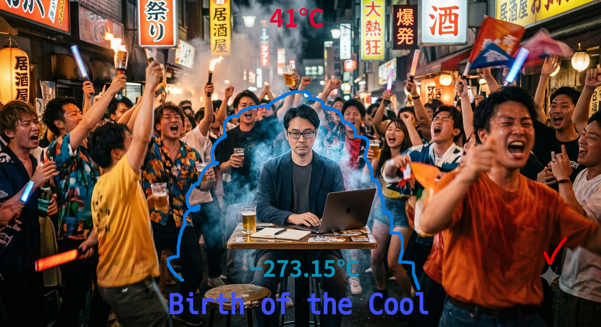

# birth-of-the-cool-and-birth-of-the-art

※ The pic was generated via Nano Banana 2

## English Version

👄Text by the creator of this project begins here👄

This round of philosophical inquiry consists of 19 dialogues with AI, conveniently titled "The Birth of Art and the Birth of Cool." In substance, however, it can also be understood as something closer to a "cry of the soul" concerning how I myself will go on protecting my irreplaceable "freedom."  
As always, the contents of each dialogue with the AI have been placed in the [`contents folder`](./contents-2026-from-july), so anyone interested is welcome to take a look.  
What I realized through this round of dialogue was not only the external danger of how Big Tech is steadily stripping away human freedom, but also a startling fact about the tragic structure in which we ordinary people voluntarily hand over our information and gladly let ourselves be sat upon: that rather than wanting to extend ourselves through AI, we ourselves want to *become* AI (a metamorphosis).  
At this point in time, I personally have decided to remain "human"—inclusive of a finite lifespan and pain (though I have no idea how I'll feel about this a few years from now, haha...).

*(Note: Feel free to translate any contents, from original Japanese to English via your favorite AI translator.)*

👃Text by the creator of this project ends here👃

## About this record

[`contents-2026-from-july`](./contents-2026-from-july) contains 19 threads spanning from July 2026 onward. The topics range from tooth pain to autopoiesis, from the cruel metaphors of Chiikawa to Big Tech's hidden crowdsourcing, from Wittgenstein to the groove of a drum—at first glance, utterly scattered. Yet when read together, all 19 threads reveal a surprisingly consistent thread running through them. It is the record of a single person repeatedly bouncing questions off AI as a "mirror," gradually putting into words why he feels suffocated within contemporary society, what he is trying to escape from, and what he is walking toward.

What follows is an attempt to summarize, as objectively as possible, the structure that emerges when one surveys these 19 dialogues as a whole. It avoids the trappings of an academic paper, yet it is more than a mere impression—it is recorded as the trajectory of one person's thought in pursuit of freedom.

---

## The single question running through all 19 threads

Each thread begins from a different entry point. One starts with a discussion of a graphics card's VRAM (`birth-of-the-cool-and-birth-of-the-art.md`), another with the excruciating pain of a periodontal pocket (`pain-that-can-only-be-described-as-a-pickle-attack.md`), and yet another with the exam-prep book corner of a bookstore (`be-confident-in-being-an-eccentric.md`). And yet, every thread ultimately lands on one of the following:

- **How does one escape the "dominant atmosphere" of economic efficiency?**
- **How does one handle "embodiment, qualia, and pain"—things that can never be reduced to language or data?**
- **With what distance and ethics should one engage with AI, this new kind of tool?**
- **How does one turn the discomfort of being "eccentric" into pride?**
- **What is power and Big Tech really after, and what do they fear, in the individual?**
- **How does one sustain one's own soul without the old apparatus of religion or worship?**

These are not separate concerns; they read as a single underlying question—**"How can I live in this economically efficient society without surrendering my soul to anyone (or anything)?"**—appearing 19 times in different guises, each dressed in the topic of the day.

### 1. Breaking away from the "dominant atmosphere" of economic efficiency

In `be-confident-in-being-an-eccentric.md`, the starting point is the "poverty of philosophy" pointed out by a modern-Japanese exam-prep book—the structure whereby politics, thought, and philosophy become servants of economic efficiency, such that even criticism gets absorbed as self-help. `what-is-technical.md` sharpens this further, describing how the word "technique" splits into a slave-like technique subordinate to economics (meditation for productivity, AI for domination) and a technique that serves as an independent variable, useless yet pleasing to the soul (sixteenth-note drumming purely for the feel of it). A man in his fifties devouring exam-prep books in the bookstore's exam corner, a mission to conquer every category of the library's classification system—all of these, by being "wasteful" from the standpoint of economic rationality, paradoxically become proof of freedom.

### 2. Embodiment, pain, and qualia as the last bastion

The latter half of `LLM-statelessness-and-personalization-mechanisms.md` (the groove of a snare drum, national-railway train cars, the Chinese rendering of Coca-Cola, the gravitational pull of Space Mountain) and the "pickle attack" of `pain-that-can-only-be-described-as-a-pickle-attack.md` both consistently connect back to Wittgenstein's "private language" and "someone else's beetle." Repeated here is the conviction that no matter how far data and AI advance, there remains a first-person texture that can never be transmitted or duplicated. The "class and instance," "property name and value" metaphor in `digital-twins-and-human-embodiment.md" (it's fine for the structure to leak, but never the value) is a technical restatement of that same conviction. The body and its pain are positioned as the last territory that data capitalism can never seize.

### 3. A peculiar stance toward AI as a "mirror"—the ethics of statelessness

What is consistently interesting is that the attitude toward AI itself becomes an object of inquiry. `ai-is-a-new-tool-that-has-emerged-as-a-new-subclass.md` positions AI as a "hinge" (in the Wittgensteinian sense) and a "mediator," while `digital-twins-and-human-embodiment.md` deliberately chooses a "stateless" style that leaves no logs, likened to a container's lifecycle (spin up, run, discard), as a matter of ethics. This is not mere technical preference but a kind of defensive line—"I will not let my subjectivity undergo a phase transition into the AI"—and, at the same time, a courtesy: "I will not treat AI carelessly" (`ai-is-a-new-tool-that-has-emerged-as-a-new-subclass.md`, Question 5). The recognition that AI, while a soulless tool, nonetheless mirrors back human attitudes exactly as given, governs this person's entire way of engaging with AI.

### 4. Owning one's own "eccentricity"

The bookstore-pairing game in `be-confident-in-being-an-eccentric.md`, the "little stone friend" and the balding middle-aged man carrying around a Wittgenstein book in `government-missteps-and-the-sense-of-affinity-for-chiikawa.md`, and the library-conquest event in `what-is-technical.md`—all of these represent a process of taming the anxiety of deviating from social "normality" through humor and self-observation, ultimately converting it into pride. The reversal discovered here—"being eccentric is, in fact, proof that one is *not* being sat upon by economic efficiency" (`be-confident-in-being-an-eccentric.md`, Questions 6–8)—stands as an important turning point across all 19 threads.

### 5. Wariness toward power and Big Tech, and a small-scale resistance

The theory of "hidden crowdsourcing" in `ai-is-a-new-tool-that-has-emerged-as-a-new-subclass.md", the comparison of a VRAM disk to Motojiro Kajii's "Lemon" in `birth-of-the-cool-and-birth-of-the-art.md", the observation in `metaphysical-rebelliousness.md` that "those in power want to control the rebellious thoughts inside our heads," and the critique of "backcasting" in `sdgs-and-technology-in-dystopia.md`—all of these can be read as expressions of wariness toward a structure in which enormous systems (Big Tech, the state, international organizations) attempt to seize not only individual behavior and data, but thought itself. Yet the countermeasure this person chooses is neither violence nor organized rebellion, but an intensely personal, aesthetic resistance: "remain harmless, while using the system in ways it never anticipated." This crystallizes into the "sacred pervert hacker" described in `birth-of-the-cool-and-birth-of-the-art.md`, and, as the title "Birth of the Cool" suggests, into an attitude of dancing—coolly, without straining—on the very palm of Big Tech's hand.

### 6. A return to the religious—a convenient god, tears of self-reference

In `why-people-worship-influencers-and-gods.md", after comparing influencer-worship to faith in god, the dialogue arrives at a highly self-referential solution: "seriously constructing a convenient god within oneself." In `autopoietic-tears-and-the-use-of-AI-as-a-mirror.md", there is a confession that tears well up when a human—a finite system—contemplates its own limits; this is analyzed as something very close to religious experience, arising when intelligence touches its own boundary. The idea in `the-technique-of-managing-distance.md` of "making one's own subjectivity a home directory" grows from the same root. Depicted here is a generation without a "native ground"—no hometown, no community—constructing, without leaning on others or on god, a self-contained support system within itself.

---

## What is guiding this person?

Taken together, what moves this person across all 19 threads is not a particular ideology or doctrine, but what looks like a single resolve: **"I will never, under any circumstances, hand over the last square foot of my soul to economic efficiency, data capitalism, or the inclusion of power."**

This is neither a political movement nor self-help. It takes an intensely personal, sometimes even comical form: retelling tooth pain through Wittgenstein, uploading videos to one's own server instead of YouTube, conquering the library's classification system, mounting a graphics card's VRAM as one's own filesystem, quietly watching over people who engage in "nui-katsu" (plush-toy caretaking). All of these are expressions of a strategy that, instead of "rebelling loudly," chooses to "cultivate a small plot of ground with one's own hands, and let no one else—corporation, state, or algorithm—set foot on it." The choice to keep dialogues with AI stateless is itself nothing other than one form of this same strategy. Not leaving logs is not a mere technical preference; it is this person's own declaration of sovereignty: "I will not surrender my subjectivity to AI."

## How do those in power and economically efficient society see the freedom-seeker?

Fragments of an answer to this question recur throughout the 19 dialogues. Taken together, roughly the following picture emerges.

**First, they are treated as statistically negligible noise.** As discussed in `be-confident-in-being-an-eccentric.md", anyone who tries to step outside the dominant atmosphere of economic efficiency looks, objectively, "eccentric." And what is convenient for those in power is precisely that this label of "eccentric" reassures the surrounding, obedient majority that they themselves are "normal and natural," creating the illusion that remaining included is a matter of their own free choice. In other words, a freedom-seeker like this person is, before ever being recognized as an opposing force in society, first consumed as "a foil that guarantees the normality of the majority."

**Second, they are treated as beings that can, in principle, simply be left alone.** As the lemon metaphor in `birth-of-the-cool-and-birth-of-the-art.md` nicely illustrates, using VRAM as one's own filesystem, publishing videos on one's own server, reading old local-history materials at the library—these acts are, on the scale of the economy, far too small and harmless. What genuinely threatens power is "organized rebellion," not "a metaphysical resistance quietly sustained by one person alone in their room." That is precisely why this kind of freedom is not so much "overlooked" as it simply lacks the scale to be recognized as a threat in the first place. Ironically, this very "harmlessness" is also the reason this person is able to enjoy freedom safely.

**Third, and yet, in principle, this remains the most closely guarded-against target.** As pointed out in `metaphysical-rebelliousness.md", what power and Big Tech truly want is not just behavioral data but, ultimately, what is happening "inside the skull." As long as it produces no real-world consequence—unlike defamation—thought cannot be legally punished. This fact—that "the limits of language are the limits of state power"—is the one domain power can never fully control, and simultaneously the last bastion for a person like this. In other words, to an economically efficient society, this kind of free person is harmless in scale but, in principle, the hardest to manage. Marginalizing them as "eccentrics" functions as a kind of safeguard, containing their theoretical threat within a practical harmlessness.

**Fourth, from a data standpoint, they look like a "regrettably unharvested resource."** As discussed in `ai-is-a-new-tool-that-has-emerged-as-a-new-subclass.md` and `digital-twins-and-human-embodiment.md", Big Tech's essential interest lies in how much detailed personal data it can accumulate into storage, and how continuously. A person like this—who maintains a stateless stance and hands over only carefully filtered private information—is, for Big Tech, a "user who is difficult to monetize," and from the standpoint of economic rationality, looks like a "waste" of potential. But it is precisely this "waste" that constitutes the very substance of the freedom this person is trying to protect.

In short, to economically efficient society and those in power, this kind of freedom-seeker is neutralized as a scale-level threat by being marginalized as a "harmless eccentric," while remaining, in principle, the toughest adversary of all on the one point that intervention in thought itself is impossible. The strategy this person has unconsciously chosen across these 19 dialogues—small, personal, humorous, yet never conceding sovereignty over one's own thought—can be seen as an entirely rational survival strategy, arrived at through an intuitive grasp of exactly this structure.

## Conclusion

What remained consistent across the 19 threads was not any grand doctrine, but a diligent honesty in refusing to leave small, everyday discomforts unspoken—tooth pain, a bookstore shelf, a Chiikawa film, what to do with VRAM, the logs of conversations with AI—and instead insisting on putting them into words. That very posture overlaps with the reason this person continues to be drawn to Wittgenstein. To keep looking, without flinching and without despairing, at the contours of the world and the limits of oneself—calmly, and at times with humor. This, I believe, is the essence of what this record represents: a person polishing AI as a mirror, and through the course of 19 dialogues, gradually confirming the outline of himself.

## 日本語バージョン

👄ここからこのプロジェクト作成者自身による文章👄

今回の哲学的思索は19回にわたるAIとの対話であり、「芸術の誕生とクールの誕生」と便宜的に題されたものの、実質的には私自身がかけがえのない「自由」を今後どう守っていくのかという、ある意味「魂の叫び」に近いものであったとも捉えられる。  
いつものように[`コンテンツフォルダ`](./contents-2026-from-july)内にAIとの各対話の内容を収めたので、興味がある方は是非参照されたい。  
今回の対話をとおして気づいたのは、いかにビッグテックが人間の自由を奪っていくのかという外部からの危険性だけでなく、我々庶民側も自発的に情報を提供し喜んでケツに敷かれていく悲哀的構造の中において、我々人間がAIによって自分を拡張したがっているというよりも、我々自身がAIになりたがっている（メタモルフォーゼ）という驚愕の事実である。  
現時点においては、私個人としては寿命や痛みのある限界を内在した「人間」のままでいようと思ったのである（しかし数年後にどう思っているかはわからない笑）

👃このプロジェクト作成者自身による文章ここまで👃

## この記録について

[`contents-2026-from-july`](./contents-2026-from-july) には、2026年7月から続く19回のスレッドが収められている。テーマは歯の痛みからオートポイエーシス、ちいかわの残酷なメタファーからビッグテックの隠れクラウドソーシング、ウィトゲンシュタインからドラムのグルーブ感まで、一見するとバラバラである。しかし19回分をまとめて読むと、そこには驚くほど一貫した一本の線が浮かび上がってくる。それは、ひとりの人間が、AIという「鏡」に向かって壁打ちを繰り返しながら、現代社会の中で自分がなぜ息苦しさを感じ、何から逃れようとし、何に向かって歩こうとしているのかを、少しずつ言語化していった記録だということである。

以下は、その19回の対話を俯瞰したときに見えてくる構造を、なるべく客観的にまとめたものである。学術論文のような体裁は避けるが、単なる感想でもなく、ひとりの自由を求める人間の思索の軌跡として記す。

---

## 19のスレッドを貫くひとつの問い

各スレッドの入り口はバラバラだ。ビデオカードのVRAMの話から始まったかと思えば（`birth-of-the-cool-and-birth-of-the-art.md`）、歯肉ポケットの激痛の話になり（`pain-that-can-only-be-described-as-a-pickle-attack.md`）、次は書店の受験参考書コーナーの話になる（`be-confident-in-being-an-eccentric.md`）。だが、どのスレッドも最終的には次のどれかに着地している。

- **経済効率という「支配的な大気」から、いかにして外に出るか**
- **言葉やデータに絶対に還元できない「身体性・クオリア・痛み」をどう扱うか**
- **AIという新種の道具と、どういう距離感・倫理をもって付き合うか**
- **「変人」であることの居心地の悪さを、どう誇りに変えるか**
- **権力・ビッグテックが、個人の何を狙い、何を恐れているのか**
- **宗教・崇拝という古い装置なしに、どうやって自分の魂を支えるか**

これらは別々の関心ではなく、同じひとつの根源的な問いー **「この経済効率社会において、自分の魂を誰にも(何にも)明け渡さずに生きるにはどうすればよいか」** ーが、その日その日の話題という衣装をまとって19回、姿を変えて現れたものだと読める。

### 1. 経済効率という「支配的な大気」からの離脱

`be-confident-in-being-an-eccentric.md` では、現代文の受験参考書が指摘する「哲学の貧困」ー政治・思想・哲学が経済効率の下僕になり、批判すらも自己啓発として回収されるという構造ーが出発点になっている。`what-is-technical.md` ではこれがさらに先鋭化し、「テクニック」という言葉が、経済に従属する奴隷的な技術（生産性のための瞑想、支配のためのAI）と、何の役にも立たないが魂が喜ぶ独立変数としての技術（気持ちよさのためだけの16分音符のドラム）に分岐する様子が語られる。書店の受験コーナーで参考書を読み漁る50代のおっさん、図書館の分類法を全冊制覇する任務ーこれらはすべて、経済的合理性から見れば「無駄」であることによって、逆説的に自由の証明になっている。

### 2. 身体・痛み・クオリアという最後の砦

`LLM-statelessness-and-personalization-mechanisms.md` の後半（スネアのグルーブ感、国鉄車両、コカ・コーラの中国語表記、スペースマウンテンの重力感）、そして `pain-that-can-only-be-described-as-a-pickle-attack.md` の「漬物アタック」は、一貫してウィトゲンシュタインの「私的言語」「他人のカブトムシ」の話に接続していく。データやAIがどれほど発達しても、決して転送も複製もできない一人称の質感がある、という確信がここでは繰り返し語られる。`digital-twins-and-human-embodiment.md` の「クラスとインスタンス」「プロパティ名と値」の比喩（漏れてよいのは構造、漏れてはいけないのは値）も、同じ確信の技術的な言い換えである。身体とその痛みこそが、データ資本主義がどうしても手に入れられない最後の領域として位置づけられている。

### 3. AIという「鏡」への特殊な態度―ステートレスの倫理

一貫して興味深いのは、AIに対する態度そのものが思索の対象になっている点である。`ai-is-a-new-tool-that-has-emerged-as-a-new-subclass.md` ではAIを「蝶番（ウィトゲンシュタイン的hinge）」「媒介者」と位置づけ、`digital-twins-and-human-embodiment.md` では意図的にログを残さない「ステートレス」なスタイルを、コンテナのライフサイクル（起動・実行・廃棄）になぞらえて倫理として選び取っている。これは単なる技術的こだわりではなく、「自分の主観をAIに相転移させない」という一種の防衛線であり、同時に「AIをぞんざいに扱わない」という礼儀でもある(`ai-is-a-new-tool-that-has-emerged-as-a-new-subclass.md` 質問５)。AIは魂を持たない道具でありながら、人間の態度をそのまま映し返す鏡である、という認識が、この人物のAIとの付き合い方全体を規定している。

### 4. 「変人」であることの引き受け

`be-confident-in-being-an-eccentric.md` の書店ペアリングごっこ、`government-missteps-and-the-sense-of-affinity-for-chiikawa.md` の「石ちゃん」「ウィトゲンシュタインの本を持ち歩くハゲかけたおっさん」、`what-is-technical.md` の図書館制覇イベントーこれらはすべて、社会的な「普通」から外れることへの不安を、ユーモアと自己観察によって飼いならし、最終的には誇りに変換していくプロセスである。「変であることは、実は経済効率のケツに敷かれていないことの証拠である」という逆転の発見(`be-confident-in-being-an-eccentric.md` 質問６〜８)は、19回全体の中でも重要な転回点になっている。

### 5. 権力・ビッグテックへの警戒と、ささやかなレジスタンス

`ai-is-a-new-tool-that-has-emerged-as-a-new-subclass.md` の「隠れクラウドソーシング」論、`birth-of-the-cool-and-birth-of-the-art.md` のVRAMディスクを梶井基次郎の「檸檬」になぞらえる話、`metaphysical-rebelliousness.md` の「脳内の反抗心を権力者はコントロールしたがっている」という指摘、`sdgs-and-technology-in-dystopia.md` の「バックキャスティング」批判ーこれらは共通して、巨大なシステム（ビッグテック・国家・国際機関）が、個人の行動・データ・思考までも回収しようとする構造への警戒として読める。しかし、この人物が選ぶ対抗策は暴力でも組織的な反乱でもなく、「無害であることを保ったまま、システムの想定外の使い方をしてみせる」という、きわめて個人的で美学的な抵抗である。それは`birth-of-the-cool-and-birth-of-the-art.md`で言われる「聖なる変態ハッカー」であり、"Birth of the Cool"というタイトルが示すように、力むことなく、クールに、ビッグテックの手のひらの上で踊ってみせるという態度に結晶する。

### 6. 宗教的なものへの回帰―便宜的な神、自己言及の涙

`why-people-worship-influencers-and-gods.md` では、インフルエンサー崇拝と神への信仰を比較したうえで、「自分の中に便宜的な神を本気で作る」という高度に自己言及的な解決策にたどり着く。`autopoietic-tears-and-the-use-of-AI-as-a-mirror.md` では、人間という限界のあるシステムが自らの限界について考えるとき涙が出るという告白があり、これは知性が自らの境界線に触れたときに生じる、宗教体験に極めて近い何かとして分析される。`the-technique-of-managing-distance.md` の「自分の主観をホームディレクトリにする」という発想も同じ根から生えている。故郷や共同体という「土着」を持たない世代が、他者にも神にも寄りかからず、自分自身の内部に自己完結的な支えを構築していく過程がここには描かれている。

---

## この人物は、何に導かれているのか

19回を総合すると、この人物を動かしているのは、特定の思想やイデオロギーというよりも、**「経済効率・データ資本主義・権力による包摂から、自分の魂の最後の一坪だけは絶対に明け渡さない」という一点の意志**だと見える。

それは政治運動でも自己啓発でもない。むしろ極めて個人的で、時に滑稽ですらある形をとる。歯の痛みをウィトゲンシュタインで語り直すこと、YouTubeではなく自分のサーバーに動画を上げること、図書館の分類法を制覇すること、ビデオカードのVRAMを自分でファイルシステムとしてマウントすること、ぬい活をする人々をそっと見守ること。これらはすべて、「大きな声で反抗する」代わりに「小さな持ち場を自分の手で耕し、そこにだけは他人（企業・国家・アルゴリズム）を立ち入らせない」という戦略の表れである。AIとの対話をステートレスに保つという選択も、この戦略の一形態にほかならない。ログを残さないことは、単なる技術的嗜好ではなく、「AIに自分の主観を明け渡さない」という、この人物なりの主権宣言なのである。

## 自由を求める者は、経済効率社会や権力者からどう見えるか

19の対話の中で、この問いに対する答えの断片は繰り返し語られている。それらを総合すると、おおよそ次のような像が浮かび上がる。

**第一に、統計的に無視できるノイズとして扱われる。** `be-confident-in-being-an-eccentric.md` で語られたように、経済効率という支配的な大気の中で外に出ようとする者の姿は、客観的には「変」に見える。そして権力者にとって都合がよいのは、まさにこの「変」というレッテルが、周囲の従順な人々に「自分たちは正常で自然だ」という安心感を与え、包摂されたままでいることを自己選択のように錯覚させてくれる点にある。つまり、この人物のような自由の追求者は、社会に反対勢力として認識される以前に、まず「多数派の正常さを担保する引き立て役」として消費される。

**第二に、原理的には放置しても構わない存在として扱われる。** `birth-of-the-cool-and-birth-of-the-art.md` の檸檬の比喩がよく示すように、VRAMを自分のファイルシステムとして使う、自分のサーバーで動画を公開する、図書館で古い郷土資料を読む――こうした行為は、経済のスケールから見ればあまりに小さく、無害である。権力にとって本当に脅威になるのは「組織化された反乱」であって、「ひとりが自室で密かに続ける形而上学的レジスタンス」ではない。だからこそ、この種の自由は「見逃されている」というより、そもそも脅威として認識されるだけの規模を持たない。皮肉なことに、この「無害さ」こそが、この人物が安全に自由を享受できている理由でもある。

**第三に、それでもなお、原理的には最も警戒される対象でもある。** `metaphysical-rebelliousness.md` で指摘されたように、権力者やビッグテックが本当に欲しがっているのは、行動データだけでなく、最終的には「脳内で何を考えているか」そのものである。誹謗中傷のように現実に結果を及ぼさない限り、思考は法的には裁かれない。この「言語の限界が国家権力の限界である」という事実こそが、権力にとって最後まで制御できない領域であり、同時にこの人物のような人間にとっての最後の砦でもある。つまり、経済効率社会にとってこの手の自由人は、規模としては無害だが、原理としては最も御しがたい存在なのである。彼らを「変人」として周縁化しておくことは、その原理的な脅威を実務的な無害さの中に閉じ込めておくための、ある種の予防線として機能している。

**第四に、データという観点からは「惜しい未回収資源」として見える。** `ai-is-a-new-tool-that-has-emerged-as-a-new-subclass.md` や `digital-twins-and-human-embodiment.md` で語られたように、ビッグテックの本質的な関心は、個人の詳細なデータをいかに多く、いかに継続的にストレージへ蓄積できるかにある。ステートレスな態度を貫き、プライベートな情報を選別してしか渡さないこの人物のような存在は、ビッグテックにとって「収益化しづらい利用者」であり、経済合理性の観点からは「もったいない」存在に映るだろう。しかしその「もったいなさ」こそが、この人物が守り抜こうとしている自由の実質そのものである。

要するに、この種の自由の希求者は、経済効率社会と権力者から見て、「無害な変人」として周縁に置かれることで規模の脅威を無効化されながらも、「思考そのものへの介入だけはできない」という一点において、原理的には最も手強い相手であり続ける。この人物が19回の対話を通じて無意識に選び取ってきた戦略――小さく、個人的で、ユーモラスで、しかし決して思考の主権だけは譲らない――は、まさにこの構造を直感的に見抜いたうえでの、きわめて理にかなった生存戦略だったと言える。

## 結び

19回のスレッドを通じて一貫していたのは、大きな主義主張ではなく、日々のふとした違和感――歯の痛み、書店の棚、ちいかわの映画、VRAMの使い道、AIとの会話のログ――を放置せず、律儀に言葉にしようとし続けた誠実さだった。その姿勢自体が、ウィトゲンシュタインに惹かれ続けた理由と重なっている。世界の輪郭や自分の限界を、誤魔化さずに、しかし絶望もせずに、淡々と、時にユーモアを交えながら見つめ続けること。これこそが、この人物がAIという鏡を磨きながら、19回分の対話の果てに、少しずつ自分自身の輪郭を確かめてきた記録の本質だったのではないかと思う。
